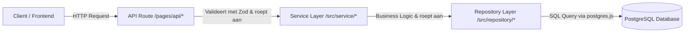

# 🍲 DishBox

**DishBox** is een moderne, self-hosted webapplicatie voor het beheren, organiseren en bewaren van je eigen kookrecepten. De applicatie is gebouwd met een sterke nadruk op prestaties, typeveiligheid en een modulaire layered architectuur.

---

## 1. Project Overzicht & Architectuur

DishBox combineert Server-Side Rendering (SSR) voor snelle paginaweergaven en SEO met interactieve client-side componenten (React Islands) waar nodig.

### Tech Stack

- **Full-stack Framework:** [Astro 5+](https://astro.build/) (geconfigureerd in `output: "server"` SSR-modus met `@astrojs/node` standalone adapter).
- **Front-end UI:** Astro componenten (`.astro`) voor SSR pagina's en layouts; [React 19](https://react.dev/) voor dynamische, interactieve multi-step formulieren.
- **Iconen & Styling:** CSS Modules, Scoped CSS, `astro-icon` met [Lucide Icons](https://lucide.dev/).
- **Database:** [PostgreSQL](https://www.postgresql.org/) met de snelle client [`postgres.js`](https://github.com/porsager/postgres) (connection pooling).
- **Validatie:** [Zod](https://zod.dev/) voor runtime schema validatie van API-requests en database responses.
- **Authenticatie:** JWT (`jsonwebtoken`) opgeslagen in veilige `HttpOnly` cookies, wachtwoord hashing via `bcryptjs`.
- **Runtime:** Node.js `>= 22.12.0`.

---

## 2. Mapstructuur (Directory Structure)

```text
dishBox/
├── public/                 # Statische publieke bestanden (favicons, etc.)
├── src/
│   ├── assets/             # Statische assets die door Astro geoptimaliseerd worden (bijv. afbeeldingen)
│   ├── components/         # Herbruikbare UI-componenten
│   ├── layouts/            # Basis HTML layouts (BaseLayout.astro, Layout.astro)
│   ├── lib/                # Externe clients en infrastructurele helpers (PostgreSQL connectie)
│   ├── pages/              # File-based routing voor pagina's en API endpoints
│   │   ├── api/            # Server-side API endpoints (JSON REST routes)
│   │   ├── ...             # Resterend pagina's
│   ├── repository/         # Data Access Layer (Rechtstreekse SQL queries naar PostgreSQL)
│   ├── service/            # Business Logic Layer (Hashing, tokens, validaties, business rules)
│   ├── types/              # TypeScript definities en interfaces (ApiResponse, Recipe, User)
│   ├── utils/              # Herbruikbare client/server utility functies (bijv. auth helpers)
│   ├── middleware.ts       # Astro middleware voor sessie-extractie en route context
│   └── env.d.ts            # Type-definities voor Astro environment variabelen
├── astro.config.mjs        # Astro configuratie (Node adapter, Astro env schema, plugins)
├── package.json            # Project dependencies en scripts
└── tsconfig.json           # TypeScript compiler configuratie
```

---

## 3. Back-end Werking

De back-end volgt een strikte **3-Layer Architecture** (Drielagenarchitectuur). Dit zorgt voor een duidelijke scheiding van verantwoordelijkheden:



### 1. API Route Layer (`src/pages/api/`)

- Ontvangt HTTP requests.
- Leest de JSON body (`await request.json()`).
- Valideert de input met een **Zod schema** (`schema.safeParse(body)`).
- Controleert authenticatie via de service layer (`authService.getAuthenticatedUserId(cookies)`).
- Retourneert altijd een gestandaardiseerd `ApiResponse<T>` JSON-object.

### 2. Service Layer (`src/service/`)

- Bevat de business logica van de applicatie.
- Voert wachtwoordhashing uit (`bcrypt.hash`) en genereert JWT tokens (`jwt.sign`).
- Valideert sessiecookies en verifieert tokens (`jwt.verify`).
- Handelt specifieke business rules af (zoals unieke username/email checks).

### 3. Repository Layer (`src/repository/`)

- De enige plek in de codebase waar SQL-queries worden uitgevoerd.
- Maakt gebruik van de `sql` tagged template literal van `postgres.js` (veilig tegen SQL-injecties).
- Mapt de geretourneerde database-rijen naar TypeScript types.

---

### Layout API endpoint

Volg altijd volgende stappen

- **Zod validation** → Create for every body a zod schema and an input type. Validate the body and return the error with `handleZodValidationError` that returns the correct response.
- **Authentication** → For authentication use the function `getAuthenticatedUserId` to verify the jwt token. It returns the correct `Authetication failed` response if needed.
- **Service** → Call the service in a `try-catch` block and always sent the custom error message with the response.

##### Template

```typescript
import { z } from "zod";
import { handleZodValidationError } from "@/service";

const schema = z.object({
  title: z.string().min(1, "Titel mag niet leeg zijn"),
  portions: z.number().positive("Porties moet een positief getal zijn"),
});

export const POST: APIRoute = async ({ request }) => {
  const body = await request.json();
  const validation = schema.safeParse(body);

  if (!validation.success) {
    return handleZodValidationError(validation.error);
  }

  try {
    await service();
    const successPayload: ApiResponse<null> = {
      success: true,
      message: "Success",
    };
    return Response.json(successPayload, { status: 200 });
  } catch (error) {
    const message = error instanceof Error ? error.message : "Failed";
    const errorPayload: ApiResponse<null> = {
      success: false,
      message,
    };

    return Response.json(errorPayload, { status: 500 });
  }
};
```

### 2. HTTP Status Codes Matrix

Gebruik altijd de juiste HTTP status code in API routes:

| Status Code              | Naam             | Wanneer gebruiken?                                                                 |
| :----------------------- | :--------------- | :--------------------------------------------------------------------------------- |
| **`200 OK`**             | Success          | Succesvolle read (`GET`), update (`PUT/PATCH`), actie (`DELETE`) of login.         |
| **`201 Created`**        | Resource Created | Succesvol aanmaken van een resource (`POST /api/recipe/addRecipe`, registratie).   |
| **`400 Bad Request`**    | Client Error     | Zod schema validatiefouten, ontbrekende verplichte velden of ongeldige parameters. |
| **`401 Unauthorized`**   | Auth Error       | Niet ingelogd, ontbrekende cookie, of verlopen/ongeldig JWT-token.                 |
| **`404 Not Found`**      | Not Found        | Opgevraagde entiteit (bijv. recept-ID of gebruiker) bestaat niet in de database.   |
| **`500 Internal Error`** | Server Error     | Onverwachte databasefouten, syntaxfouten of servercrashes.                         |

---
