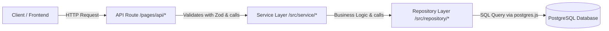

# 🍲 DishBox

**DishBox** is a modern, self-hosted web application for managing, organizing, and saving your personal cooking recipes. The application is built with a strong focus on performance, type-safety, and a modular layered architecture.

---

## 1. Project Overview & Architecture

DishBox combines Server-Side Rendering (SSR) for fast page loads and SEO with interactive client-side components (React Islands) where needed.

### Tech Stack

- **Full-stack Framework:** [Astro 5+](https://astro.build/) (configured in `output: "server"` SSR mode with `@astrojs/node` standalone adapter).
- **Front-end UI:** Astro components (`.astro`) for SSR pages and layouts; [React 19](https://react.dev/) for dynamic, interactive multi-step forms.
- **Icons & Styling:** CSS Modules, Scoped CSS, `astro-icon` with [Lucide Icons](https://lucide.dev/).
- **Database:** [PostgreSQL](https://www.postgresql.org/) with the fast [`postgres.js`](https://github.com/porsager/postgres) client (connection pooling).
- **Validation:** [Zod](https://zod.dev/) for runtime schema validation of API requests and database responses.
- **Authentication:** JWT (`jsonwebtoken`) stored in secure `HttpOnly` cookies, password hashing with `bcryptjs`.
- **Runtime:** Node.js `>= 22.12.0`.

---

## 2. Directory Structure

```text
dishBox/
├── public/                 # Static public files (favicons, etc.)
├── src/
│   ├── assets/             # Static assets optimized by Astro (e.g. images)
│   ├── components/         # Reusable UI components
│   ├── layouts/            # Base HTML layouts (BaseLayout.astro, Layout.astro)
│   ├── lib/                # External clients and infrastructure helpers (PostgreSQL connection)
│   ├── pages/              # File-based routing for pages and API endpoints
│   │   ├── api/            # Server-side API endpoints (JSON REST routes)
│   │   ├── ...             # Remaining pages
│   ├── repository/         # Data Access Layer (Direct SQL queries to PostgreSQL)
│   ├── service/            # Business Logic Layer (Hashing, tokens, validations, business rules)
│   ├── types/              # TypeScript definitions and interfaces (ApiResponse, Recipe, User)
│   ├── utils/              # Reusable client/server utility functions (e.g. auth helpers)
│   ├── middleware.ts       # Astro middleware for session extraction and route context
│   └── env.d.ts            # Type definitions for Astro environment variables
├── astro.config.mjs        # Astro configuration (Node adapter, Astro env schema, plugins)
├── package.json            # Project dependencies and scripts
└── tsconfig.json           # TypeScript compiler configuration
```

---

## 3. Back-end Architecture

The back-end follows a strict **3-Layer Architecture**. This ensures a clear separation of concerns:



### 1. API Route Layer (`src/pages/api/`)

- Receives HTTP requests.
- Reads the JSON body (`await request.json()`).
- Validates the input with a **Zod schema** (`schema.safeParse(body)`).
- Checks authentication via the service layer (`authService.getAuthenticatedUserId(cookies)`).
- Always returns a standardized `ApiResponse<T>` JSON object.

### 2. Service Layer (`src/service/`)

- Contains the business logic of the application.
- Handles password hashing (`bcrypt.hash`) and generates JWT tokens (`jwt.sign`).
- Validates session cookies and verifies tokens (`jwt.verify`).
- Handles specific business rules (such as unique username/email checks).

### 3. Repository Layer (`src/repository/`)

- The only place in the codebase where SQL queries are executed.
- Uses the `sql` tagged template literal from `postgres.js` (safe against SQL injection).
- Maps returned database rows to TypeScript types.

---

### Layout API Endpoint

Always follow these steps:

- **Zod validation** → Create a Zod schema and input type for every request body. Validate the body and return errors using `handleZodValidationError`, which sends the appropriate error response.
- **Authentication** → Use `getAuthenticatedUserId` to verify the JWT token for protected routes. It automatically returns the standard `Authentication failed` response when invalid.
- **Service** → Call the service within a `try-catch` block and always send a custom error message with the response.

> See Template `src/pages/api/template.Ts`

---

### 4. HTTP Status Codes Matrix

Always use the appropriate HTTP status code in API routes:

| Status Code              | Name             | When to use?                                                                  |
| :----------------------- | :--------------- | :---------------------------------------------------------------------------- |
| **`200 OK`**             | Success          | Successful read (`GET`), update (`PUT/PATCH`), action (`DELETE`), or login.   |
| **`201 Created`**        | Resource Created | Successful creation of a resource (`POST /api/recipe/edit`, registration).    |
| **`400 Bad Request`**    | Client Error     | Zod schema validation errors, missing required fields, or invalid parameters. |
| **`401 Unauthorized`**   | Auth Error       | Not logged in, missing cookie, or expired/invalid JWT token.                  |
| **`404 Not Found`**      | Not Found        | Requested entity (e.g. recipe ID or user) does not exist in the database.     |
| **`500 Internal Error`** | Server Error     | Unexpected database errors, syntax errors, or server crashes.                 |
